# Learning Management System (LMS)

A full-stack Learning Management System built with Django, Django Rest Framework, React, and SQLite. The platform supports three user roles — **Students**, **Teachers**, and **Admins** — each with tailored dashboards and functionality.

## Table of Contents

- [Features](#features)
- [Tech Stack](#tech-stack)
- [Project Structure](#project-structure)
- [Wireframes](#wireframes)
- [How It Works](#how-it-works)
- [Setup & Installation](#setup--installation)
- [Running the Application](#running-the-application)
- [Running Tests](#running-tests)
- [API Reference](#api-reference)
- [Deployment](#deployment)
- [Technologies & Libraries](#technologies--libraries)

---

## Features

### Student
- Browse all available courses
- Enroll and unenroll from courses
- View a personal dashboard showing enrolled courses

### Teacher
- Create new courses with a title and description
- Edit and delete their own courses
- View a dashboard showing only their courses

### Admin
- Create, edit, and delete any course
- View summary statistics (total users, courses, enrollments)
- Manage all users — change roles or delete accounts

### General
- User registration with role selection (Student or Teacher)
- Secure token-based authentication
- Responsive design that works on mobile, tablet, and desktop
- Role-based access control on both frontend and backend
- Dark/light theme toggle with localStorage persistence
- Editable user profile with avatar and bio
- Leaderboard with top courses and teachers
- Achievements & badges system with progress tracking
- Searchable Help/FAQ page
- About page with mission, values, and platform stats
- Notification bell with dropdown panel

---

## Tech Stack

| Layer      | Technology                        |
|------------|-----------------------------------|
| Backend    | Python, Django 6, Django REST Framework |
| Frontend   | JavaScript, React 19, Material UI |
| Database   | PostgreSQL (Heroku) / SQLite (local) |
| Auth       | Token Authentication (DRF)        |
| Testing    | Django TestCase, React Testing Library |
| HTTP Client| Axios                             |
| Routing    | React Router v6                   |

---

## Project Structure

```
LearningManagementSystem/
├── README.md
├── docs/
│   └── API.md                    # Full API endpoint documentation
│
├── backend/
│   ├── requirements.txt          # Python dependencies
│   ├── manage.py                 # Django management script
│   ├── lms_project/
│   │   ├── settings.py           # Django configuration
│   │   ├── urls.py               # Root URL routing
│   │   └── wsgi.py               # WSGI entry point
│   ├── accounts/
│   │   ├── models.py             # Custom User model with roles
│   │   ├── serializers.py        # User/Auth serializers
│   │   ├── views.py              # Auth & user management views
│   │   ├── permissions.py        # IsAdmin permission class
│   │   ├── urls.py               # Auth & user URL routes
│   │   └── tests.py              # Auth API tests (12 tests)
│   └── courses/
│       ├── models.py             # Course & Enrollment models
│       ├── serializers.py        # Course/Enrollment serializers
│       ├── views.py              # Course CRUD & enrollment views
│       ├── permissions.py        # Role-based permission classes
│       ├── urls.py               # Course URL routes
│       └── tests.py              # Course API tests (13 tests)
│
└── frontend/
    ├── package.json              # Node dependencies
    └── src/
        ├── App.js                # Root component with routing & theme
        ├── api/
        │   └── axiosConfig.js    # Axios instance with auth interceptor
        ├── contexts/
        │   └── AuthContext.js    # Global authentication state
        ├── components/
        │   ├── Navbar.js         # Responsive navigation bar
        │   ├── ProtectedRoute.js # Route guard with role checking
        │   └── CourseCard.js     # Reusable course display card
        ├── pages/
        │   ├── Login.js          # Login form
        │   ├── Register.js       # Registration form with role selector
        │   ├── CourseList.js     # Browse all courses with filters & sorting
        │   ├── CourseDetail.js   # Single course view with hero image
        │   ├── StudentDashboard.js  # Student enrolled courses & stats
        │   ├── TeacherDashboard.js  # Teacher course management & stats
        │   ├── AdminDashboard.js    # Platform overview & management
        │   ├── UserManagement.js    # Admin user table
        │   ├── Profile.js          # Editable user profile
        │   ├── Leaderboard.js      # Top courses & teachers ranking
        │   ├── About.js            # Our mission & values page
        │   ├── Achievements.js     # Badges & gamification
        │   ├── HelpFAQ.js          # Searchable FAQ & contact form
        │   └── Settings.js         # Theme toggle & preferences
        └── __tests__/            # React component tests (29 tests)
```

---

## Screenshots

### Login Page
Split-screen layout with an Unsplash hero image on the left featuring the LearnHub brand and tagline. The right panel contains username and password fields, a gradient "Sign in" button, and a link to the registration page.

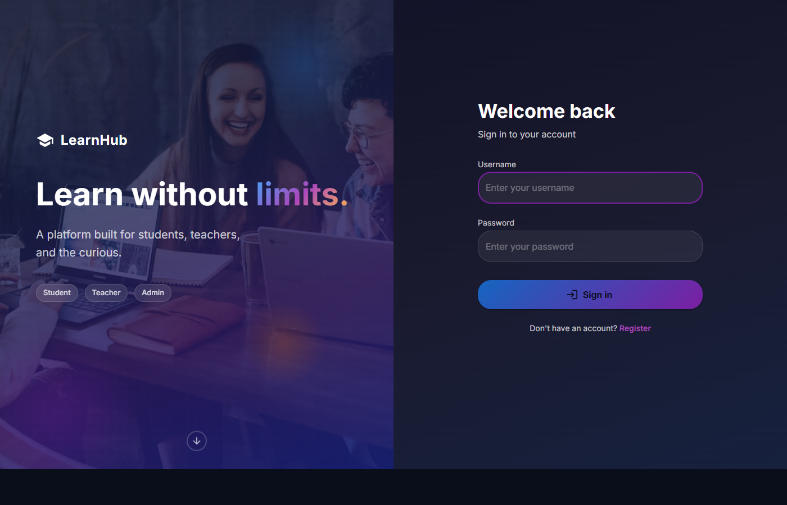

### Registration Page
Similar split-screen layout with a different hero image. The right panel includes fields for username, email, password, confirm password, and a role selector (Student or Teacher). Client-side validation checks that passwords match before submitting.

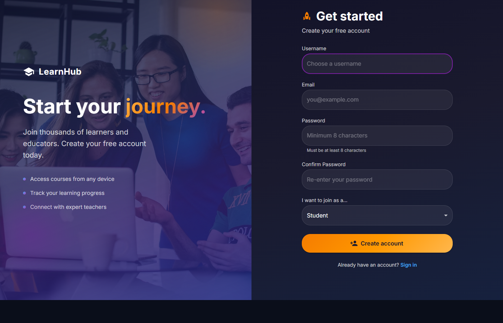

### Student Dashboard
Hero banner with welcome message and stats badges (Courses Enrolled, Active Learner). A grid of course cards with Unsplash header images showing the student's enrolled courses. Sort and filter controls with a "Browse Courses" button.

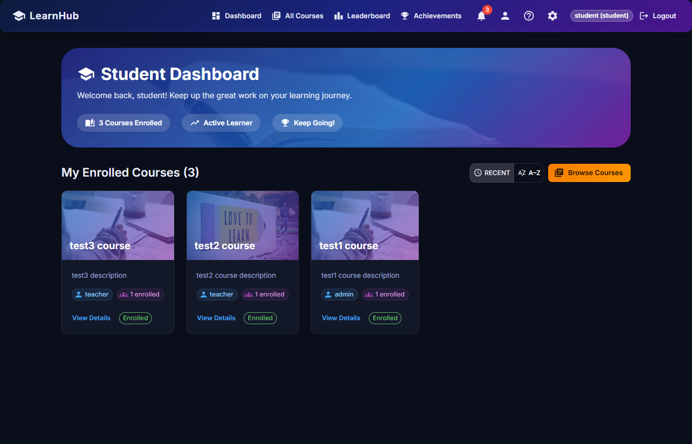

### Teacher Dashboard
Hero banner with course and student stats. A "Create Course" button opens a dialog with title and description fields. Course cards display with Edit and Delete action buttons.

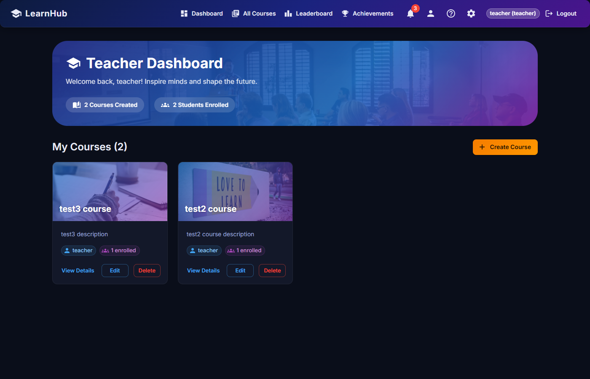

### Admin Dashboard
Hero banner with platform overview stats (Total Users, Total Courses, Total Enrollments). Course grid with full management actions. Links to User Management and course creation.

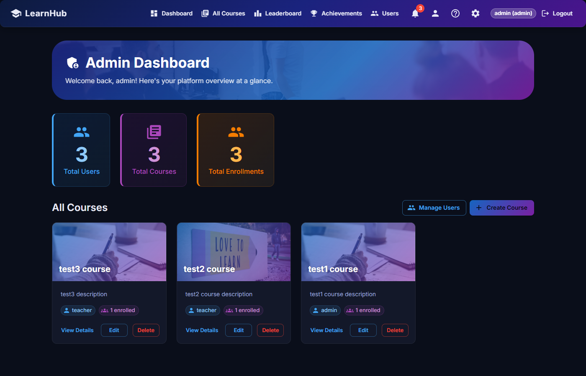

### Course List Page
Hero banner with search bar, teacher filter chips, and sort controls (Recent/A-Z). Responsive grid of course cards with rotating Unsplash header images, teacher badges, and enrollment counts.

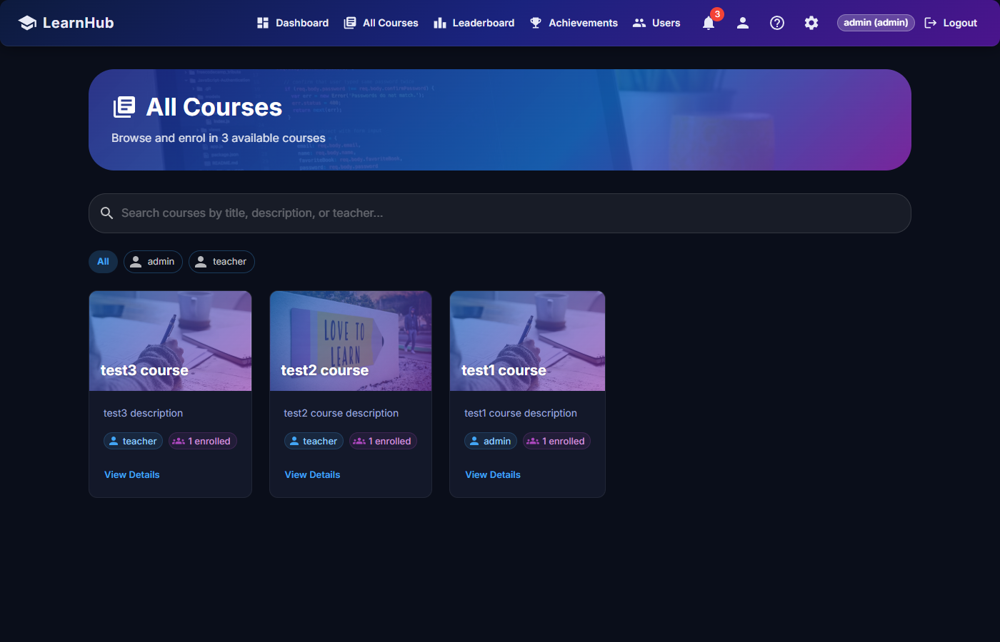

### Course Detail Page
Hero image banner with the course title overlaid. Full course information including teacher name, creation date, enrollment count, and description. Action buttons vary by role.

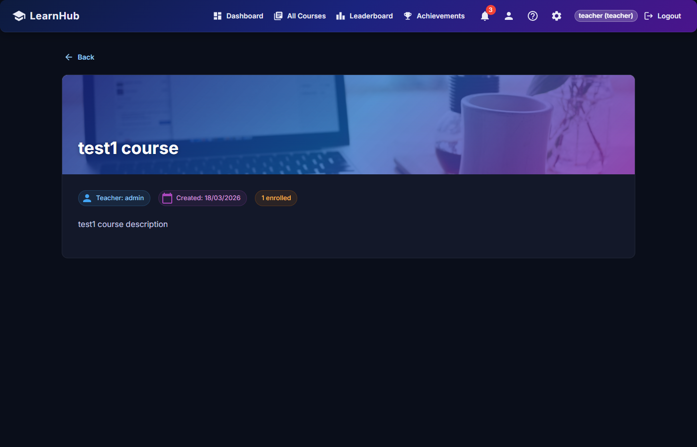

### User Management Page (Admin)
Hero banner with a data table listing all users. Columns: Username, Email, Role (editable dropdown), Date Joined, and a Delete button. Admins cannot modify or delete their own account.

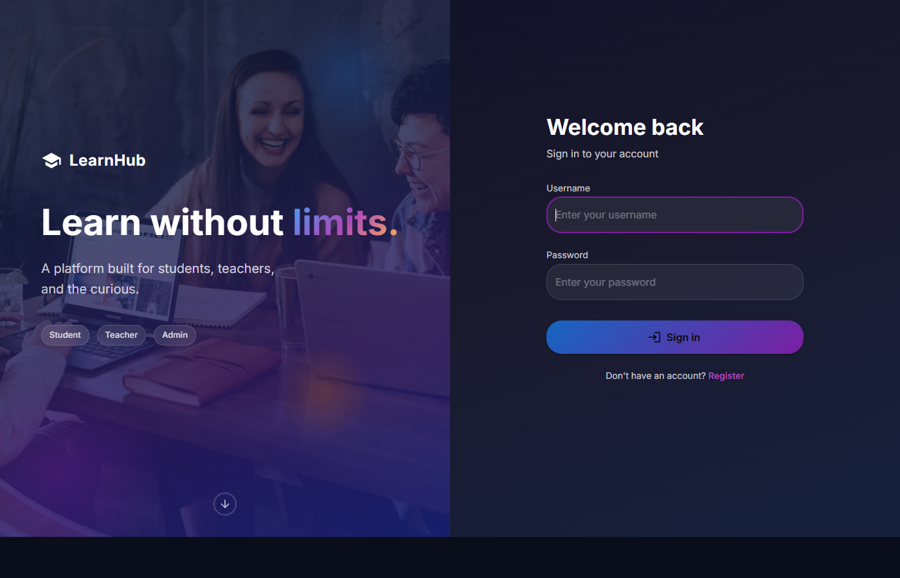

### About / Our Mission
Full marketing-style page with hero banner, mission statement, feature cards (Learn Together, Grow Your Skills, Build Community), how-it-works steps, values section, platform stats, and a call-to-action.


### Leaderboard
Gamified ranking page showing Most Popular Courses (with gold/silver/bronze medals) and Top Teachers, aggregated from enrollment data.

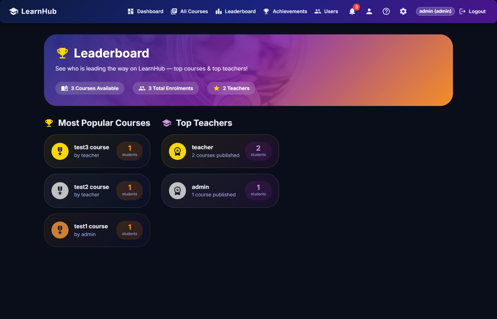

### Achievements
Badge/achievement system with 10 unlockable achievements. Progress bar, unlocked achievements with coloured cards, and locked achievements shown in greyscale.

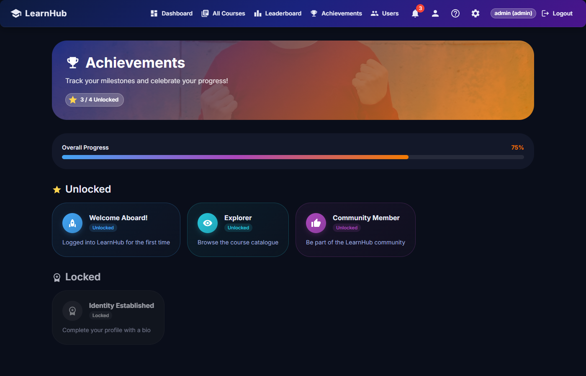

### Profile
Editable user profile with avatar (initials), stats sidebar, form fields for name and bio, and read-only account information section.

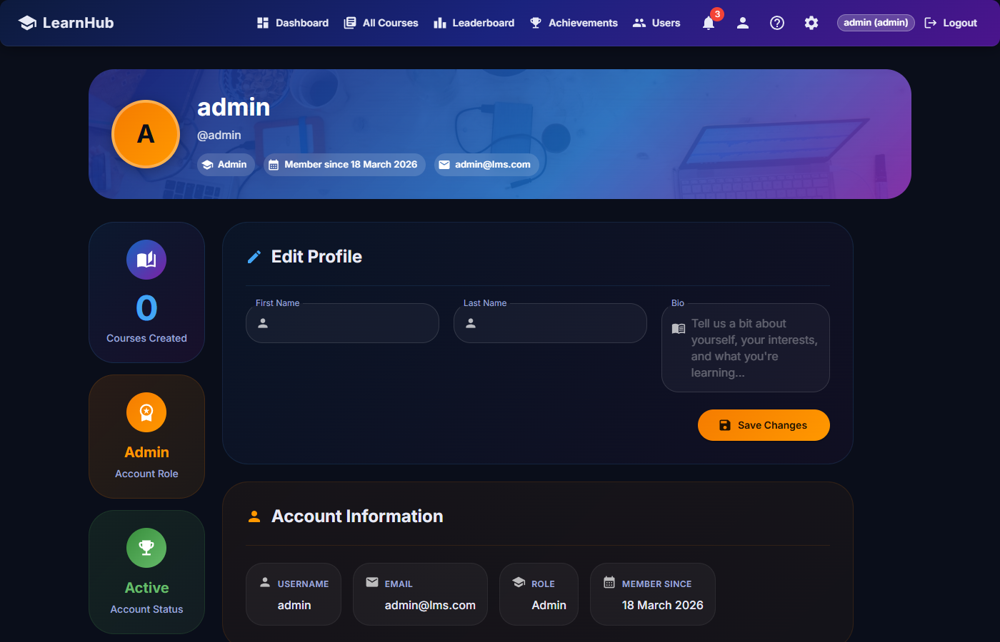

### Settings
Appearance settings with dark/light mode toggle, notification preferences, and account management options.

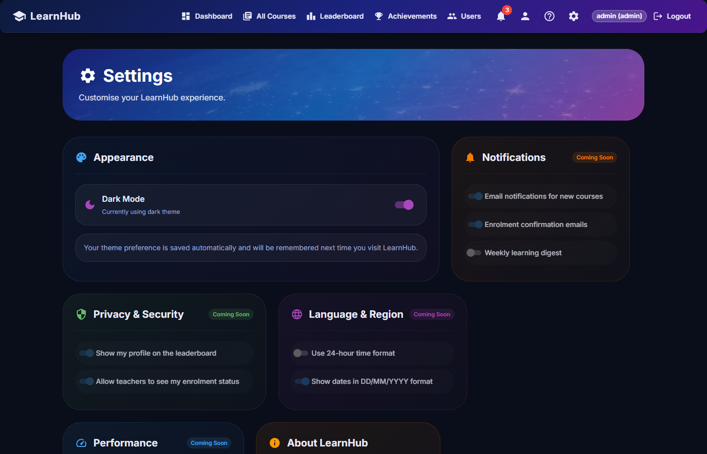

### Help / FAQ
Searchable accordion FAQ with categorised questions, and a contact/support form at the bottom.

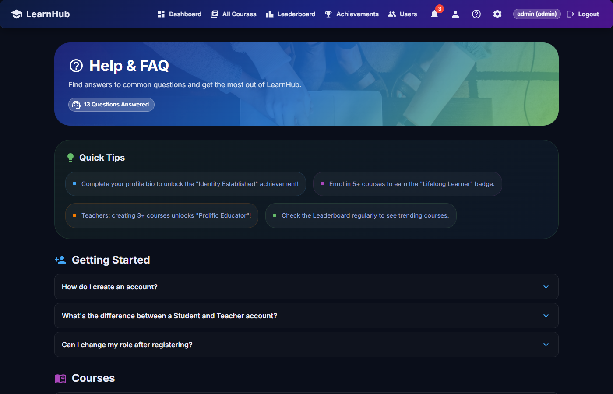

---

## How It Works

### Architecture Overview

The application follows a **client-server architecture** with a clear separation between the frontend and backend:

1. **React Frontend** (port 3000) sends HTTP requests to the Django API
2. **Django Backend** (port 8000) processes requests, enforces permissions, and interacts with the SQLite database
3. **Token Authentication** secures the API — the frontend stores the token in `localStorage` and attaches it to every request via an Axios interceptor

### Authentication Flow

1. User submits credentials on the Login/Register page
2. Django validates and returns a **Token** + user data
3. React stores the token in `localStorage` and the user object in `AuthContext`
4. All subsequent API requests include the token in the `Authorization` header
5. On page refresh, the app calls `/api/auth/me/` to rehydrate the user from the stored token

### Role-Based Access Control

**Backend:** Custom DRF permission classes (`IsAdmin`, `IsTeacherOrAdmin`, `IsCourseOwnerOrAdmin`, `IsStudent`) enforce access rules at the API level. Even if the frontend is bypassed, the backend will reject unauthorized requests.

**Frontend:** The `ProtectedRoute` component checks the user's role before rendering a page. The `Navbar` dynamically shows different links based on the user's role.

### Data Models

- **User** — extends Django's `AbstractUser` with a `role` field (student, teacher, or admin)
- **Course** — has a title, description, and a foreign key to the teacher who created it
- **Enrollment** — a join table linking students to courses (unique together constraint prevents duplicate enrollments)

---

## Setup & Installation

### Prerequisites

- Python 3.10+
- Node.js 18+
- npm 9+
- Git

### Backend Setup

```bash
# Clone the repository
git clone https://github.com/BluUsername/LearningManagementSystem.git
cd LearningManagementSystem

# Create and activate virtual environment
cd backend
python -m venv venv

# Windows
source venv/Scripts/activate
# macOS/Linux
source venv/bin/activate

# Install dependencies
pip install -r requirements.txt

# Run database migrations
python manage.py migrate

# Create a superuser (admin account)
python manage.py createsuperuser
```

### Frontend Setup

```bash
# From the project root
cd frontend

# Install dependencies
npm install
```

---

## Running the Application

You need **two terminal windows** — one for the backend and one for the frontend.

### Terminal 1 — Backend (Django)

```bash
cd backend
source venv/Scripts/activate  # or source venv/bin/activate on macOS/Linux
python manage.py runserver
```

The API will be available at `http://localhost:8000`.

### Terminal 2 — Frontend (React)

```bash
cd frontend
npm start
```

The app will open at `http://localhost:3000`.

### Quick Start

1. Start both servers as described above
2. Open `http://localhost:3000` in your browser
3. Register a new account (choose Student or Teacher role)
4. Log in and explore your role-specific dashboard
5. To access the admin dashboard, log in with the superuser account you created and change its role to "admin" via the Django admin panel at `http://localhost:8000/admin/`

---

## Running Tests

### Backend Tests (Django)

```bash
cd backend
source venv/Scripts/activate
python manage.py test --verbosity=2
```

**25 tests** covering:
- User registration (valid, password mismatch, duplicate username)
- Login (valid and invalid credentials)
- Current user endpoint and unauthenticated access
- Admin user management permissions
- Course CRUD with role-based permissions
- Student enrollment and unenrollment
- Duplicate enrollment prevention

### Frontend Tests (React)

```bash
cd frontend
npm test
```

**29 tests** covering:
- CourseCard rendering and truncation
- Login form rendering and interaction
- Register form rendering and password validation
- Navbar logged-in vs logged-out states
- ProtectedRoute authentication redirect
- CourseList rendering, search, and API integration
- AuthContext token management and error handling

---

## API Reference

Full API documentation is available in [docs/API.md](docs/API.md).

### Quick Reference

| Method | Endpoint | Description | Access |
|--------|----------|-------------|--------|
| POST | `/api/auth/register/` | Register a new user | Public |
| POST | `/api/auth/login/` | Log in and get token | Public |
| POST | `/api/auth/logout/` | Log out (delete token) | Authenticated |
| GET | `/api/auth/me/` | Get current user info | Authenticated |
| GET | `/api/courses/` | List all courses | Authenticated |
| POST | `/api/courses/` | Create a course | Teacher, Admin |
| GET | `/api/courses/:id/` | Get course details | Authenticated |
| PUT | `/api/courses/:id/` | Update a course | Course owner, Admin |
| DELETE | `/api/courses/:id/` | Delete a course | Course owner, Admin |
| POST | `/api/courses/:id/enroll/` | Enroll in a course | Student |
| DELETE | `/api/courses/:id/unenroll/` | Unenroll from a course | Student |
| GET | `/api/enrollments/` | List my enrollments | Student |
| GET | `/api/users/` | List all users | Admin |
| PATCH | `/api/users/:id/` | Update a user | Admin |
| DELETE | `/api/users/:id/` | Delete a user | Admin |

---

## Deployment

The application is deployed and live:

| Service | Platform | Live URL |
|---------|----------|----------|
| **Frontend** | Netlify | [https://thelearnhub.netlify.app](https://thelearnhub.netlify.app) |
| **Backend API** | Heroku | [https://lms-backend-tom-25f123572e9b.herokuapp.com](https://lms-backend-tom-25f123572e9b.herokuapp.com) |

### Deployment Stack

- **Backend (Heroku):** Gunicorn WSGI server, WhiteNoise for static files, PostgreSQL database (via Heroku Postgres), dj-database-url for config, environment-based configuration for secrets and CORS
- **Frontend (Netlify):** Production React build served via Netlify CDN, `netlify.toml` handles SPA routing redirects, `REACT_APP_API_URL` env var points to the Heroku backend

---

## Technologies & Libraries

### Backend
- [Django](https://www.djangoproject.com/) — Web framework
- [Django REST Framework](https://www.django-rest-framework.org/) — REST API toolkit
- [django-cors-headers](https://github.com/adamchainz/django-cors-headers) — Cross-origin request handling

### Frontend
- [React](https://react.dev/) — UI library
- [Material UI](https://mui.com/) — Component library
- [Axios](https://axios-http.com/) — HTTP client
- [React Router](https://reactrouter.com/) — Client-side routing
- [React Testing Library](https://testing-library.com/docs/react-testing-library/intro/) — Component testing
